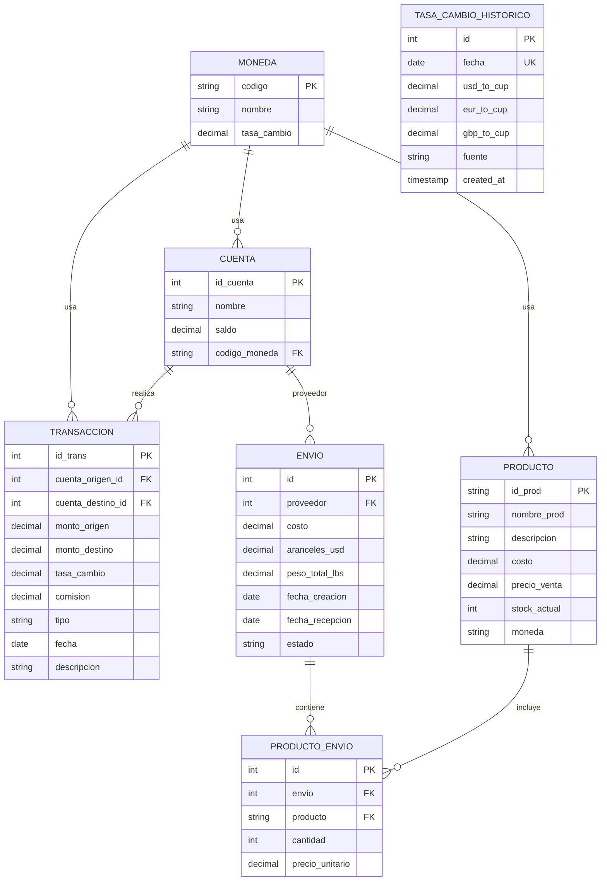

# Mi App de Ventas 🚀

Una aplicación de **Electron + React + TypeScript + PostgreSQL** para gestionar ventas, cuentas, envíos y transacciones con conversión de monedas.

## 📌 Contexto General

- **Propósito**: Gestionar mis cuentas personales (CoinEx, QvaPay, MPay), productos, envíos y transacciones, con un enfoque en la conversión de monedas (USD, CUP, EUR).

- **Tecnologías**:

  - Frontend: React + TypeScript + Vite + Tailwind CSS + Recharts (gráficos).

  - Backend: Electron + Node.js.

  - Base de datos: PostgreSQL (acceso vía TypeORM).

## 💱 Gestión de Tasas de Cambio

Las tasas de cambio se gestionan **manualmente** (no se usa ninguna API externa).

- **Servicio**: `src/main/services/tasaCambioService.ts` expone:
  - `getTasaActual(codigo_moneda)`: tasa actual desde la tabla `Moneda`.
  - `getTasaPorFecha(fecha, codigo_moneda)`: tasa en una fecha desde `tasa_cambio_historico`.
  - `getTasasHistoricas()`: todo el histórico.
  - `agregarTasaManual(tasa)`: alta/edición manual de una tasa (también sincroniza USD en `Moneda`).
  - `importarTasasDesdeExcel(filePath)`: importa tasas desde un Excel (`xlsx`).
- **UI**: `src/renderer/components/TasaCambioModal.tsx` (formulario manual, importar Excel,
  tabla de histórico y gráfico de variación USD → CUP con Recharts). Se abre desde el botón
  "Tasas de Cambio" en el encabezado de `App.tsx`, que también muestra la tasa USD → CUP actual.

## 🗃 Estructura de la Base de Datos

### Entidades y Relaciones

| Entidad | Descripción | Relaciones |
|---------|-------------|------------|
| **Cuenta** | Mis cuentas personales (ej: CoinEx, QvaPay). | Tiene transacciones (origen/destino). |
| **Moneda** | Monedas (USD, CUP, EUR) y su tasa de cambio actual. | Usada en Cuenta, Producto, Transaccion. |
| **Producto** | Productos que compró/vendó (con costo, precio de venta, stock). | Relacionada con ProductoEnvio. |
| **Envio** | Envíos de productos (con proveedores, costos, aranceles). | Relacionada con ProductoEnvio y Cuenta (proveedor). |
| **ProductoEnvio** | Relación muchos a muchos entre Envio y Producto. | Vincula productos a envíos. |
| **Transaccion** | Movimientos de dinero entre cuentas (transferencias, compras, ventas, envíos). | Relacionada con Cuenta (origen/destino) y Envio. |
| **tasa_cambio_historico** | Histórico de tasas de cambio (ingresadas manualmente o desde Excel). | - |

### Diagrama ER



### DDL: tasa_cambio_historico

```sql
CREATE TABLE tasa_cambio_historico (
    id SERIAL PRIMARY KEY,
    fecha DATE NOT NULL UNIQUE,  -- Evitar duplicados por fecha
    usd_to_cup DECIMAL(10, 4) NOT NULL,
    eur_to_cup DECIMAL(10, 4),
    gbp_to_cup DECIMAL(10, 4),
    fuente VARCHAR(20) DEFAULT 'manual',  -- 'manual' o 'excel'
    created_at TIMESTAMP DEFAULT NOW()
);
```
